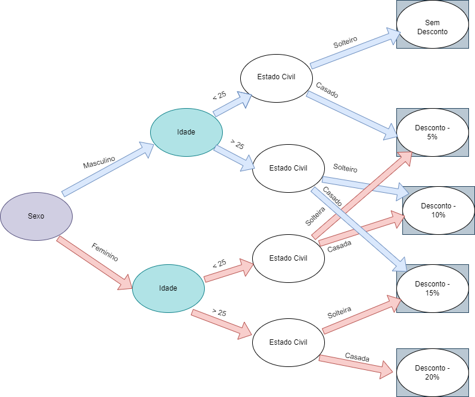

**NOME: Virgínia de Fernandes Souza** 
**MATRÍCULA: 201700281**

###Especificações

1.Considere o seguinte cenário: Uma corretora de seguros concede desconto sobre o prêmio anual de seguro de automóvel, aos seus segurados conforme as regras a seguir:
|Sexo|Idade (anos)|Estado Civil|Desconto (%)|
|---|---|---|---|
|Masculino|< 25|Solteiro|0|
|Masculino|< 25|Casado|5|
|Masculino|> 25|Solteiro|10|
|Masculino|> 25|Casado|15|
|Feminino|< 25|Solteira|5|
|Feminino|< 25|Casada|10|
|Feminino|> 25|Solteira|15|
|Feminino|> 25|Casada|20|

2. Solicita-se:
   1. Geração do grafo de causa e efeito para representar este cenário.
      1. Anexar a este arquivo a imagem do grafo.

   2. Geração da tabela de decisão para representar o cenário.
      1. Editar este arquivo e adicionar a tabela de decisão.
| |Regra1|Regra2|Regra3|Regra4|Regra5|Regra6|Regra7|Regra8|
|---|---|---|---|---|---|---|---|---|
|**Condições**| | | | | | | | |
|Sexo|Masculino|Masculino|Masculino|Masculino|Feminino|Feminino|Feminino|Feminino|
|Idade (anos)|< 25|< 25|> 25|> 25|< 25|< 25|> 25|> 25|
|Estado Civil|Solteiro|Casado|Solteiro|Casado|Solteira|Casada|Solteira|Casada|
|**Ações**| | | | | | | | |
|Desconto|0%|5%|10%|15%|5%|10%|15%|20%|

   3. Geração do conjunto de casos de teste suficientes para cobrir todos os cenários, constantes do grafo e da tabela de decisão.
      1. Editar este arquivo e adicionar a tabela com os casos de teste, conforme exemplos disponibilizados em tarefas anteriores.

   4. Em relação aos casos de teste, considere o valor do seguro de R$ 2.000,00 (Dois mil reais). Desta forma, o valor esperado, do resultado do caso de teste, deve ser o valor líquido a ser pago. Ou seja, o prêmio deduzido do valor correspondente ao percentual do desconto obtido pelo cliente.

