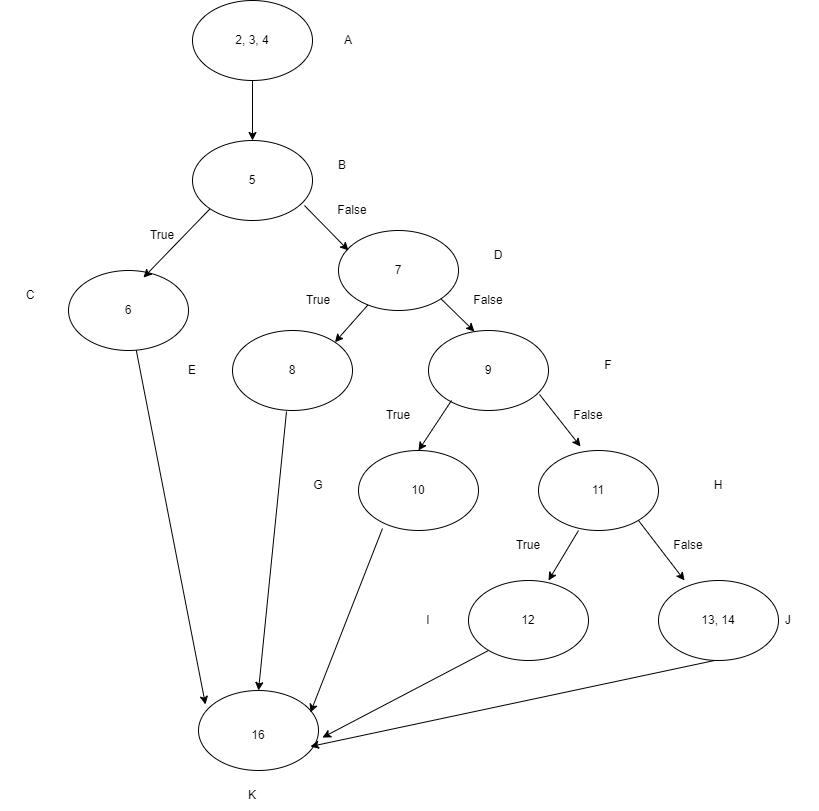

1. Considere o fragmento de código implementado na Linguagem de Programação Java.

~~~java

public class Avaliacao {

1    public String avalia(double nota1, double nota2, int faltas, int cargaHoraria) throws ValoresInvalidosException{
2        String result;
3        double percentualFaltas = (faltas*100/cargaHoraria);
4        double media = (nota1 + nota2)/2;
5        if((nota1 < 0.0 || nota1 > 10) || (nota2 < 0.0 || nota2 > 10) || (faltas < 0 || faltas > cargaHoraria) || cargaHoraria < 0){
6            throw new ValoresInvalidosException();//result = "Valores Inválidos.";
7        }else if(percentualFaltas > 25.0){
8            result = "Reprovado por Falta.";
9        }else if(media < 3.0){
10            result = "Reprovado por Média.";
11        }else if(media >= 3.0 && media < 6.0){
12            result = "Prova Extra.";
13        }else{
14            result = "Aprovado.";
15        }
16        return result;
17    }
18 }
~~~

2. Pede-se:
   1. Desenhar o **Grafo do Fluxo de Controle**. Pode-se anexar a imagem, aqui neste arquivo.
   
   
   2. Calcular a complexidade ciclomática do código. Exemplo de como calcular pode ser obtido no [link](https://www.treinaweb.com.br/blog/complexidade-ciclomatica-analise-estatica-e-refatoracao)

   Seguindo a fórmula:
  V(G) = E - N + 2
   

   Sendo **E** o número de arestas e **N** o número de nós:
   V(G) = 16-13 + 2 

   V(G) = 5

   3. Definir quantos caminhos de execução existem;
 Quantidade de Caminhos: 5
       
       Os caminhos são: **ABCK** , **ABDEK**, ABDFGK; ABDFHI; ABDFHJK;

   4. Definir os casos de teste necessários para se percorrer todos estes caminhos. Cada caso de teste deve ter o valor correspondente para cada variável de entrada e o valor esperado.
   Variáveis:   **nota1**,  **nota2**,  **faltas**,  **cargaHoraria**

| Caso de Teste | nota1 | nota2 | faltas | cargaHoraria | Saída    |
| ------------- | ----- | ----- | ------ | ------------ | --- |
| CT1           | -5    | 20    | 20     | 40           | "Valores inválidos"    |
| CT2           |  20     | 20      | 40       |   40           | "Reprovado por falta"    |
| CT3           |   10    | 10      |  0      | 40             | "Reprovado por Medio"    |
| CT4           |   40    | 40      |   0     |   40           |  "Prova extra"   |
| CT5           | 80  | 80      |  0      |  40            | "Aprovado"    |

INSTRUÇÕES:
1. Tipo: Tarefa Individual;
2. Local de Entrega: _branch main/master_ do repositório pessoal do aluno, criado para a manutenção do controle de versão dos artefatos da disciplina. O arquivo a ser entregue, pode ser este mesmo, editado com as respostas das questões solicitadas.
3. Data da Entrega: 21/02/2021, as 23h59min.
4. Critério de Aceitação: arquivo entregue, conforme solicitado.