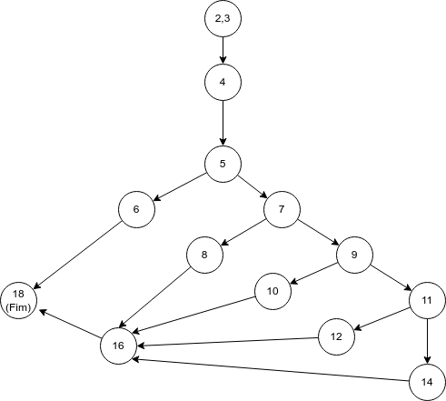

## Tarefa 006 - 15/02/2022 - Grafo de Fluxo de Controle

1. Considere o fragmento de código implementado na Linguagem de Programação Java.

~~~java

public class Avaliacao {

1    public String avalia(double nota1, double nota2, int faltas, int cargaHoraria) throws ValoresInvalidosException{
2        String result;
3        double percentualFaltas = (faltas*100/cargaHoraria);
4        double media = (nota1 + nota2)/2;
5        if((nota1 < 0.0 || nota1 > 10) || (nota2 < 0.0 || nota2 > 10) || (faltas < 0 || faltas > cargaHoraria) || cargaHoraria < 0){
6            throw new ValoresInvalidosException();//result = "Valores Inválidos.";
7        }else if(percentualFaltas > 25.0){
8            result = "Reprovado por Falta.";
9        }else if(media < 3.0){
10            result = "Reprovado por Média.";
11        }else if(media >= 3.0 && media < 6.0){
12            result = "Prova Extra.";
13        }else{
14            result = "Aprovado.";
15        }
16        return result;
17    }
18 }
~~~

2. Pede-se:
   2.1. Desenhar o **Grafo do Fluxo de Controle**. Pode-se anexar a imagem, aqui neste arquivo.
   

     
   

   2.2. Calcular a complexidade ciclomática do código. Exemplo de como calcular pode ser obtido no [link](https://www.treinaweb.com.br/blog/complexidade-ciclomatica-analise-estatica-e-refatoracao)
   Resposta:
   Arcos/Arestas = 16
   Vértices = 13
   CC = 16 - 13 + 2 = 5

   2.3. Definir quantos caminhos de execução existem.
      C1 = 2,3,4,5,6,18 - onde alguma das variáveis terá um valor inválido.
      C2 = 2,3,4,5,7,8,16,18 - Reprovação por faltas.
      C3 = 2,3,4,5,7,9,10,16,18 - Reprovado por média.
      C4 = 2,3,4,5,7,9,11,12,16,18 - Prova Extra.
      C5 = 2,3,4,5,7,9,11,14,16,18 - Aprovado.

   2.4. Definir os casos de teste necessários para se percorrer todos estes caminhos. Cada caso de teste deve ter o valor correspondente para cada variável de entrada e o valor esperado.

|CT|nota1|nota2|faltas|caragaHoraria|Valor Esperado|
|---|---|---|---|---|---|
|CT01|11.00|7.00|5|64|"Valores Inválidos."|
|CT02|10.00|7.00|20|64|"Reprovado por Falta."|
|CT03|2.00|1.00|5|64|"Reprovado por Média."|
|CT04|5.00|3.00|5|64|"Prova Extra."|
|CT05|11.00|7.00|5|64|"Aprovado."|

INSTRUÇÕES:
1. Tipo: Tarefa Individual;
2. Local de Entrega: _branch main/master_ do repositório pessoal do aluno, criado para a manutenção do controle de versão dos artefatos da disciplina. O arquivo a ser entregue, pode ser este mesmo, editado com as respostas das questões solicitadas.
3. Data da Entrega: 21/02/2021, as 23h59min.
4. Critério de Aceitação: arquivo entregue, conforme solicitado.
